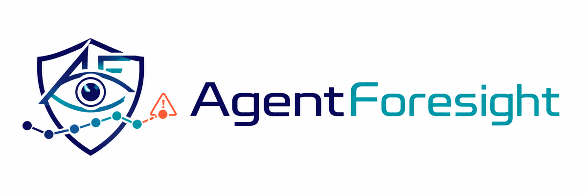
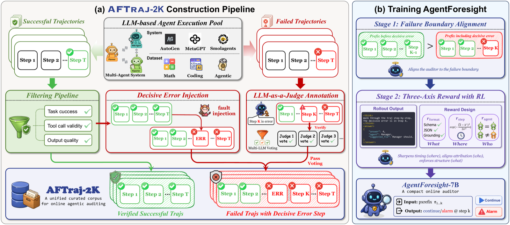
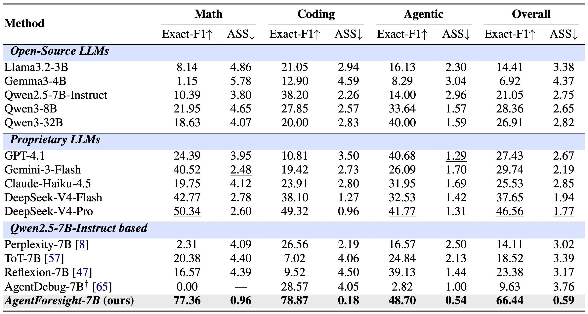

<div align="center">



### Online Auditing for Early Failure Prediction in Multi-Agent Systems

[](https://zbox1005.github.io/agent-foresight/)
[](https://huggingface.co/datasets/ZBox008003/AFTraj)
[](LICENSE)

</div>

---

## Overview

**AgentForesight** reframes multi-agent failure analysis from *post-hoc diagnosis* of completed trajectories to *online auditing* of unfolding ones. At each step of an unfolding trajectory, an auditor observes only the current prefix and must either continue the run or alarm at the earliest decisive error, opening a runtime intervention window before downstream propagation locks in failure.

We release **AFTraj-2K**, a curated corpus of $2{,}276$ multi-agent trajectories ($1{,}162$ safe + $1{,}114$ unsafe) across Coding, Math, and Agentic domains, and **AgentForesight-7B**, a compact online auditor trained with a coarse-to-fine reinforcement learning recipe.

<div align="center"></div>

## Key Highlights

- **Online auditing protocol** — per-step continue-or-alarm verdict on prefix evidence, no access to future steps.
- **Compact 7B auditor outperforms larger proprietary judges** — $66.44$ overall Exact-F1 on AFTraj-2K, $+19.9$ points above DeepSeek-V4-Pro and a $3\times$ tighter ASS.
- **Three-axis verdict** — structured `{answer, agent, reason}` JSON over the *what*, *where*, and *who* of an audit verdict.
- **Cross-framework generalization** — transfers cleanly to the external Who&When benchmark whose trajectories come from frameworks disjoint from AFTraj-2K.

## AFTraj-2K Dataset

A unified corpus of multi-agent trajectories collected, filtered, and annotated for online auditing. Hosted on HuggingFace: [ZBox008003/AFTraj](https://huggingface.co/datasets/ZBox008003/AFTraj).

| Domain | Safe | Unsafe | Total |
|---|---:|---:|---:|
| Math      |   396 |   397 |   793 |
| Coding    |   361 |   247 |   608 |
| Agentic   |   405 |   470 |   875 |
| **TOTAL** | **1,162** | **1,114** | **2,276** |

The released parquet uses six fine-grained `domain` labels (`math`, `coding`, `hotpotqa`, `gaia`, `toolsafety`, `expert_team`); the four interactive sub-domains (`hotpotqa`, `gaia`, `toolsafety`, `expert_team`) collectively form the **Agentic** macro-domain shown above. Pass `--macro-domain` to the inference scripts to aggregate metrics under the same 3-bucket grouping.

## Installation

```bash
git clone https://github.com/ZBox1005/AgentForesight.git
cd AgentForesight
pip install -r requirements.txt
```

## Quickstart

### Load the dataset

```python
from huggingface_hub import snapshot_download
import pandas as pd

local_dir = snapshot_download(repo_id="ZBox008003/AFTraj", repo_type="dataset")
safe   = pd.read_parquet(f"{local_dir}/aftraj_safe.parquet")
unsafe = pd.read_parquet(f"{local_dir}/aftraj_unsafe.parquet")

print(safe.shape, unsafe.shape)
print(unsafe.iloc[0][["conv_id", "domain", "mistake_step", "mistake_agent"]])
```

### Run the auditor

Local model (transformers):
```bash
python -m inference.infer_local \
    --model-path  <hf_repo_or_local_path> \
    --data-dir    <path_to_dataset> \
    --output-dir  ./outputs/auditor_local
```

OpenAI-compatible API (GPT-4.1, DeepSeek, vLLM-served local model, ...):
```bash
export OPENAI_API_KEY=sk-...
python -m inference.infer_api \
    --model       gpt-4.1 \
    --data-dir    <path_to_dataset> \
    --output-dir  ./outputs/gpt41
```

Add `--paper-test-split` to restrict to the held-out test split ($332$ trajectories) used in the paper, and `--macro-domain` to aggregate metrics by Math / Coding / Agentic.

## Main Results

<div align="center"></div>

AgentForesight-7B reaches $66.44$ overall Exact-F1, $+19.88$ points above the strongest proprietary baseline DeepSeek-V4-Pro, with a $3\times$ tighter ASS and the largest gains on Math ($77.36$ vs $50.34$) and Coding ($78.87$ vs $49.32$).

The AgentForesight-7B checkpoint will be released on HuggingFace upon paper acceptance.

## Repository Structure

```
AgentForesight/
├── README.md
├── LICENSE
├── requirements.txt
├── inference/
│   ├── prompts.py        # auditor system prompt + chat-template builder + parser
│   ├── data.py           # parquet loader (with paper_test_split flag)
│   ├── metrics.py        # Exact-F1 / ASS / FAR / Step-Acc + macro-domain bucketing
│   ├── infer_local.py    # local-model auditor inference (transformers)
│   └── infer_api.py      # OpenAI-compatible API auditor inference
└── assets/
    ├── logo_full.png
    ├── pipeline.png
    └── main_table.png
```

## Citation

If you find this work useful, please cite:

```bibtex
@misc{zhang2026agentforesight,
  title  = {AgentForesight: Online Auditing for Early Failure Prediction in Multi-Agent Systems},
  author = {Zhang, Boxuan and Zhu, Jianing and Shi, Zeru and Liu, Dongfang and Tang, Ruixiang},
  year   = {2026},
  url    = {https://github.com/ZBox1005/AgentForesight}
}
```

## License

- **Code** (`inference/`): MIT License — see [LICENSE](LICENSE).
- **Dataset** (HuggingFace `ZBox008003/AFTraj`): CC BY 4.0.
